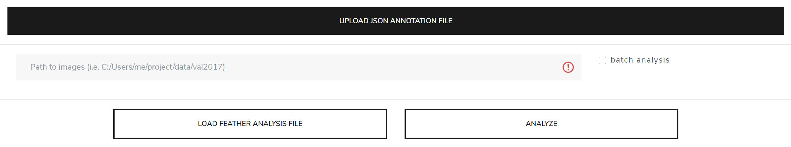
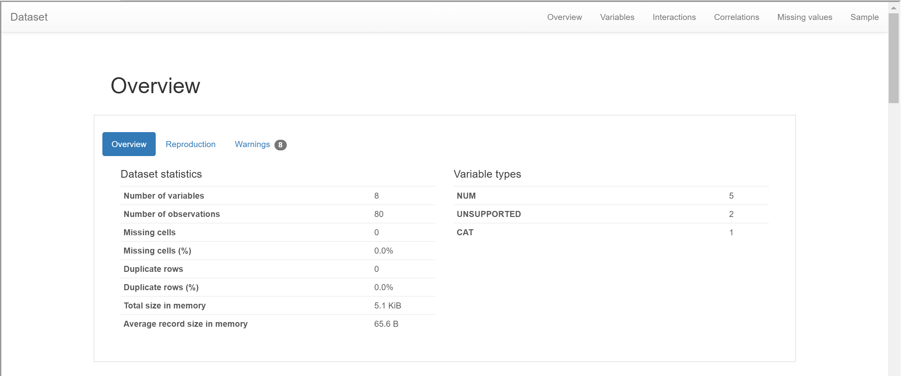
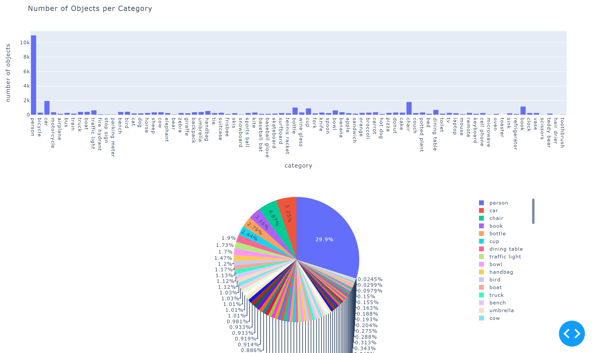
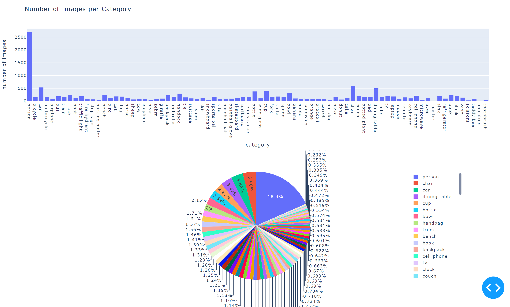
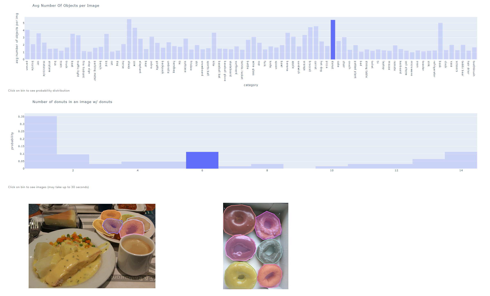
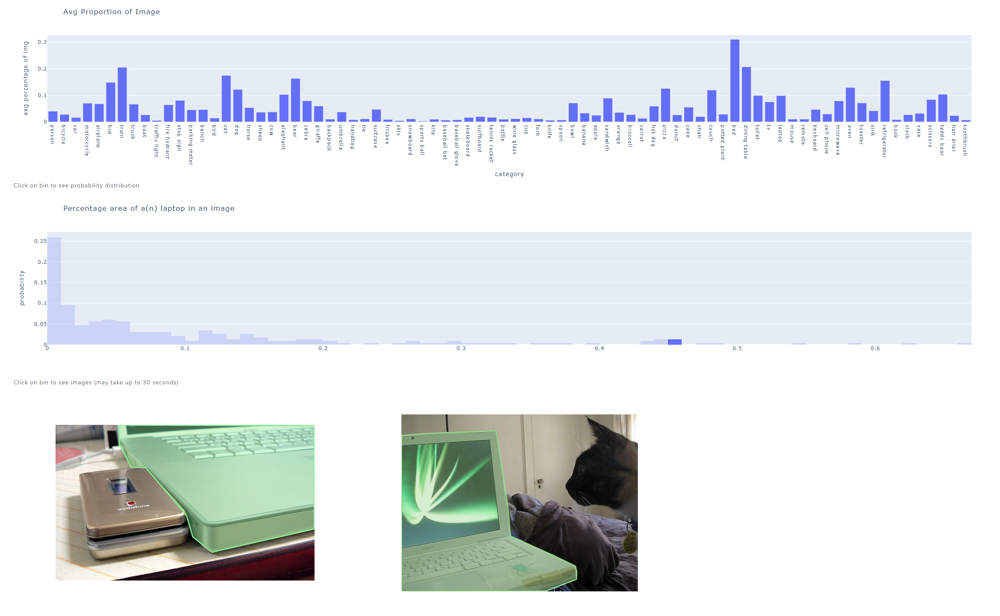
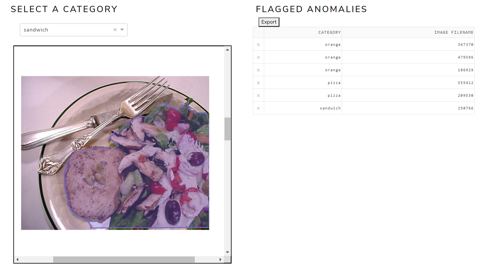
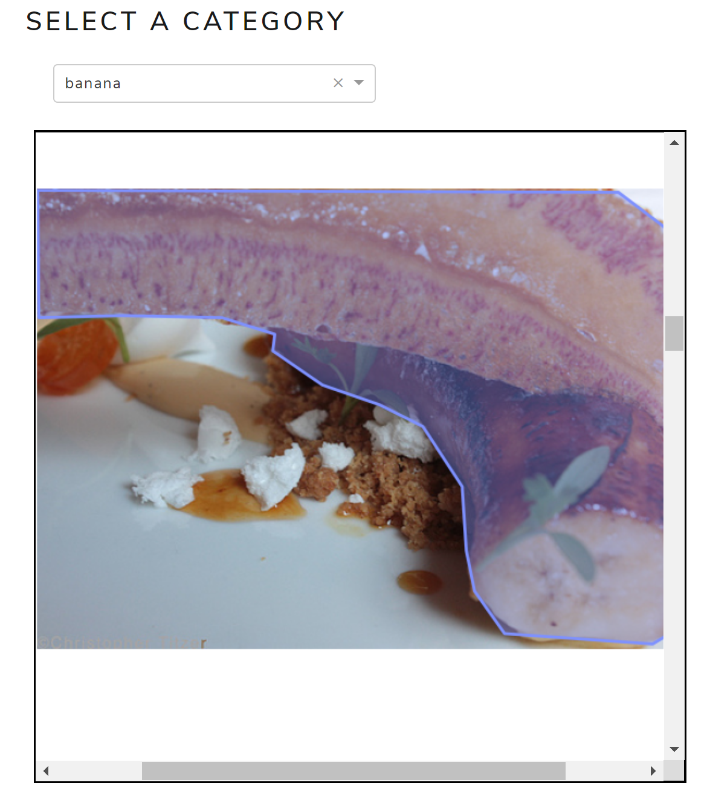
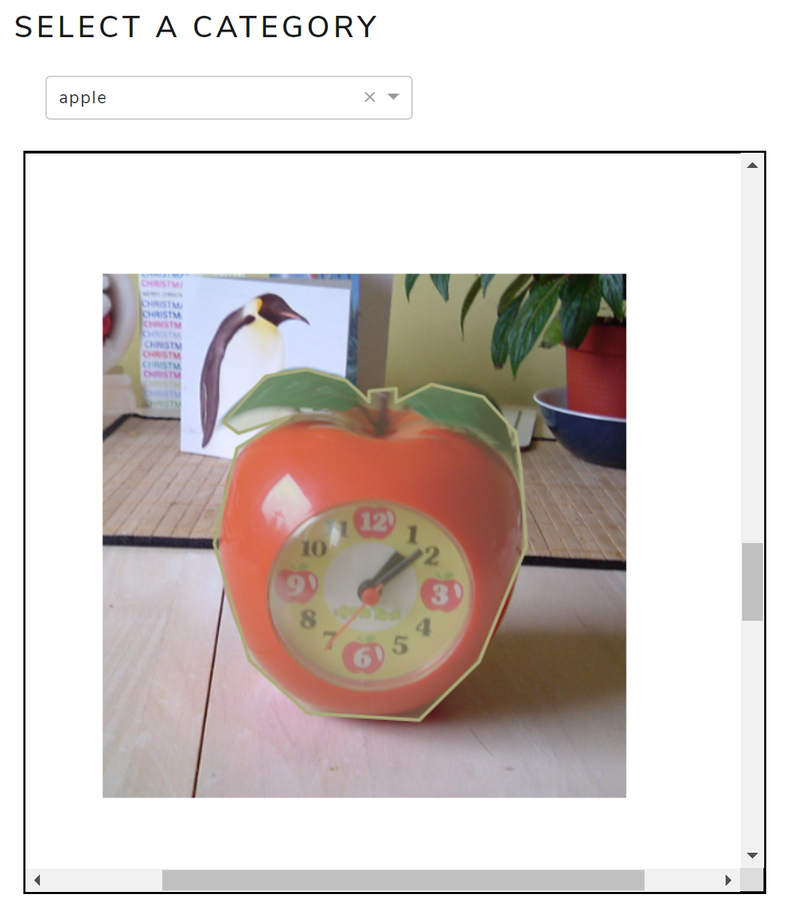
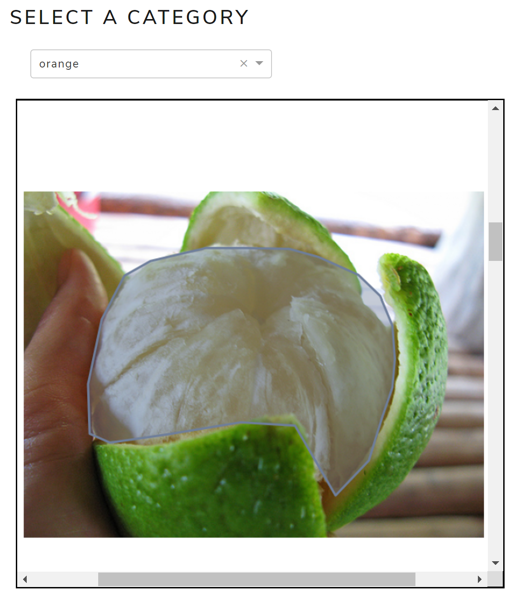

# VIZ EDA
This document provides a tutorial on how to use the app.

## Quick start
1. Upload your COCO-dataset styled JSON annotation file.
2. Input the absolute path to your image data. For example: "C:/Users/me/project/data/val2017images".
3. Click "ANALYZE". Analyzing takes about 5-20 minutes, depending on the size of your data.

## Loading from feather
The app outputs a feather file after running the analysis. The "analysis{datetime}" file can be loaded into the app to
allow for quick visualization and exploratory data analysis without having to run the analysis again.

## Exploratory data analysis

### Overview
Pandas profiling visualization of overall analysis table. Variables include objects per class, images per class, objects
per image, proportion of object in image, and roughness of segmentation.

### Objects per class
The bar graph displays the number of objects in the dataset provided, sorted by category. The pie chart shows a
breakdown of the proportion of objects in each category.

### Images per class
The bar graph displays the number of images containing one or more objects of a category. The pie chart shows a
breakdown of the images per category.

### Objects per image
The first chart displays the average number of objects of a given class contained in image. For example, given images
with one or more cars, the chart displays the average number of cars in those images. To see the distribution of the
number of objects per image, click on a bin of your choice. To see the images that contain n objects of a given
category, on the probability histogram, click on a bin of your choice.

### Proportion of object in image
The first chart displays the average proportion an object of a certain category takes up in an image. To see the
distribution of proportions an object takes up in image, click on a bin of your choice. To see the images that contain
objects of a given category taking up x% of a image, click on a bin of your choice.

## Anomaly detection
1. Select a category from the dropdown list to see the anomalies from that category. The anomaly objects are
highlighted in colour. Note that these objects were flagged by the model.
2. To manually flag an image containing an anomaly, simply click on the image.
3. Click "Export" to download an Excel file containing the list of manually flagged images, along with their respective
categories.

banana anomaly             |  apple anomaly          |  orange anomaly
:-------------------------:|:-------------------------:|:-------------------------:
  |   | 
