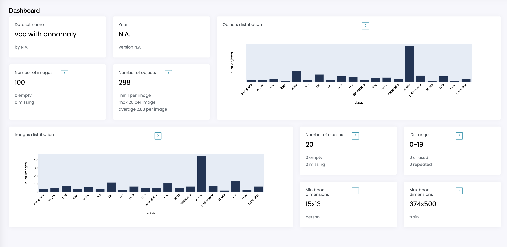
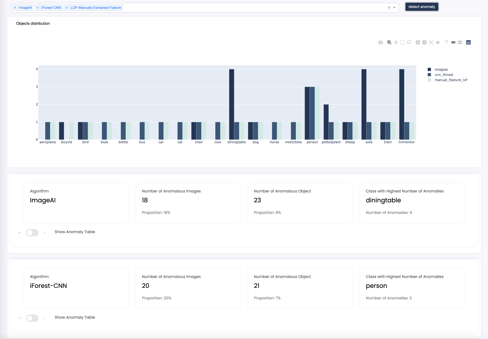
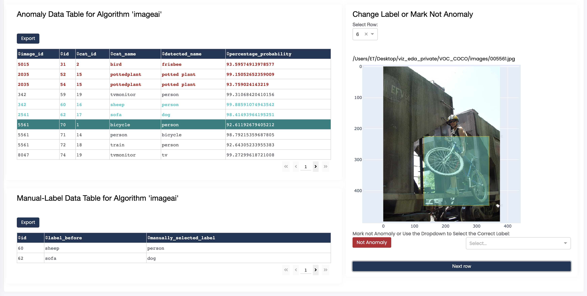

# VIZ EDA
vizEDA is an exploratory data analysis tool that helps to visualize and improve complex computer vision COCO-datasets.

## Usage
### New analysis
1. Upload your COCO-dataset styled JSON annotation file
2. Input the absolute path to your image data. For example: /Users/me/project/data/val2017images"
3. Click "ANALYZE"

#### File structure
The image directory should look as follows:
```markdown
image_dir
├── image1
├── image2
│...
├── imageN
```

### Existing analysis
1. Upload your JSON analysis file downloaded from a previous session
2. Click "VIEW"

## Analysis sections

### Dashboard
The dashboard provides an overview of the dataset, displaying basic information such as dataset name, contributor, year and version.
It also contains information about the number of images, objects and classes in the dataset, as well as class IDs and bounding boxes dimensions.
Finally, it displays images and objects distributions per class to let you immediately notice non-uniform representation.


### Warnings
The warnings section tells you about problems in your dataset. It is divided into three sections: classes, IDs and images.
For each section it provides a description of a warning and the dataset instances that trigger the warning.
For example, if a class appears in the dataset but has no annotations, it will be tagged as empty. 
If an image appears in the dataset but the file is not in the directory provided, it will be tagged as missing.
Images are also checked for dimensions, here we use 1920x1080 as standard.


### Classes
The classes section lets you visualize the dataset class by class. It provides information about the class such as number of images and objects,
and min and max bounding box dimensions, as well as displaying all images, along with the file names, containing objects from that class.


### Stats
The stats section displays in more detail the image and object distribution by class from the dashboard.


### Anomalies
The anomalies section shows the result of the automated anomaly detection run by the app on your dataset.

1. Select algorithm(s) from the dropdown list to compute anomalies, the result will be stored
and available for download later.

2. Summaries about anomalous objects and a graphical comparison between different algorithms are displayed.


3. Toggle the anomaly table button to display a table containing computation details as well as an image viewing window.
4. Manually flag a non-anomalous objects (marked in red) or give an anomalous object the correct label (marked in green) if you wish.
5. Click "Export" to download an Excel file containing the list of algorithmically computed anomalies or manually flagged objects.


## Built With
### UI Framework
* [Dash](https://plotly.com/dash/) -A framework for building ML and data science apps.

## Authors
* **Yankang Zhu** - [GitHub](https://github.com/yk220284)
* **Davide Locatelli** - [GitHub](https://github.com/dl2198)
* **Ricky Ma** - [GitHub](https://github.com/ricky-ma)